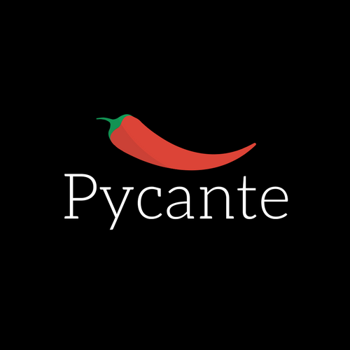

# Pycante


## Introduction
Pycante is the world’s hottest programming language, taking inspiration from the functional capabilities of Javascript and blending in the spacing of Python to bring the user the most intuitive, pleasing experience. Boasting dictionary capabilities, and both static typing and scoping, Pycante is the future of learnable, readable, and reusable code.

## Features
* .pyc file extension
* Type inference: uses what to find out the type of a variable for example, what(TYPE)
* Static typing
* Static scoping
* Strong typing
* Space matching
* Assignment is handled using “let”
* List Ranges? Comprehensions?
* String Interpolation?
* For loop, while loop, if statement
* Composition and object orientation. 


## Examples
```
~ variable declaration
let x = 12

let y = 10

let z = 0 

```
